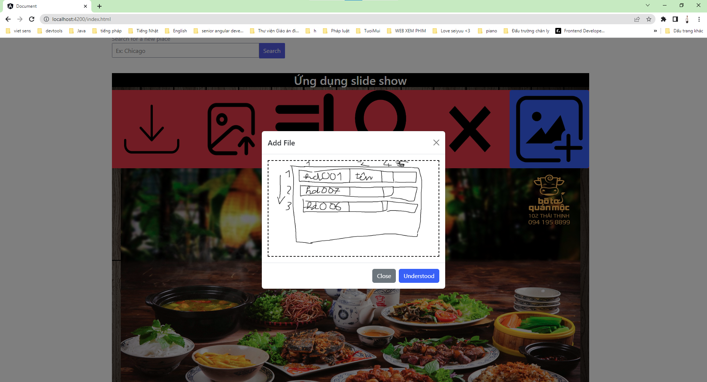
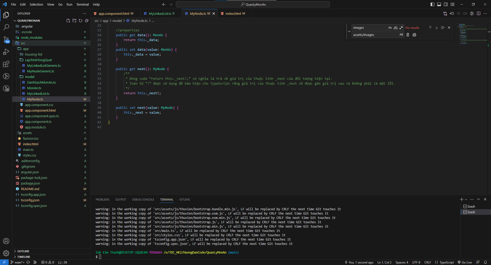

# QuanLyMonAn

## cập nhật 05/07/2023

- Thêm xóa sửa đọc ghi file sắp xếp tìm kiếm chi tiết
- Danh sách món ăn service

- kéo thả

## Cập nhật 4/07/2023

- ôn tập typescript (Coursera)
- Chép file slide show vào project angular

- cập nhật mã nguồn angular project

- component dishes

## Cập nhật 2/07/2023

- Ôn tập angular (Xem video google)
- Thực hành angular
- Thêm thanh chức năng
- 

## cập nhật 1/07/2023

- thêm class generic node và linked list
- 

## cập nhật 29/06/2023

- cập nhật quản lý món ăn
- 
- Thêm nút add hình món ăn
- 

## cập nhật 28/06/2023

- thêm slide show món ăn
